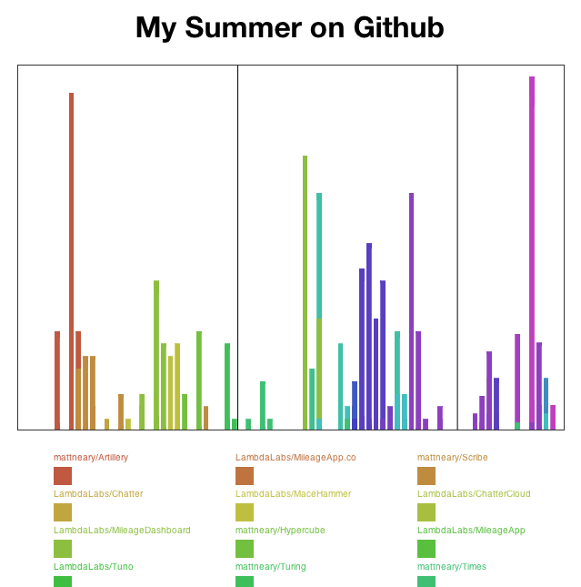

HubChronos
==========
HubChronos aims to build upon the Github profile, rendering a color-coded bar graph of commits in timeline form. A legend is then presented beneath the graph labeling colors as repositories to which you have contributed.

This is most useful for considering when, and for how long, you worked on each of your projects. The raw commit data is also exposed to allow you to make your own interesting manipulations on the client-side.

Example
-------


Usage
-----
###Credentials
Create a `creds.json` file containing your username, password, and any organizations of which you are a member as JSON. The following is an example.

```json
{
	"username": "XXX",
	"password": "XXX",
	"organizations": ["XXX", "XXX"]
}
```

###Endpoints
There are three endpoint modes to the included server:

1. Commit History Fetching at `/fetch`.
2. Commit Fetched-Data Presentation at `/dump`.
3. Graph Page Presentation at any other endpoint.

###Server
To view your graph, first run the server having setup your credentials.

```sh
$ node server.js
Initiating Server on Port 8080
```

Then connect to the fetching endpoint.

```sh
curl localhost:8080/fetch
```

Now you can render the Graph page at the root endpoint.

```sh
$ open http://localhost:8080/
```